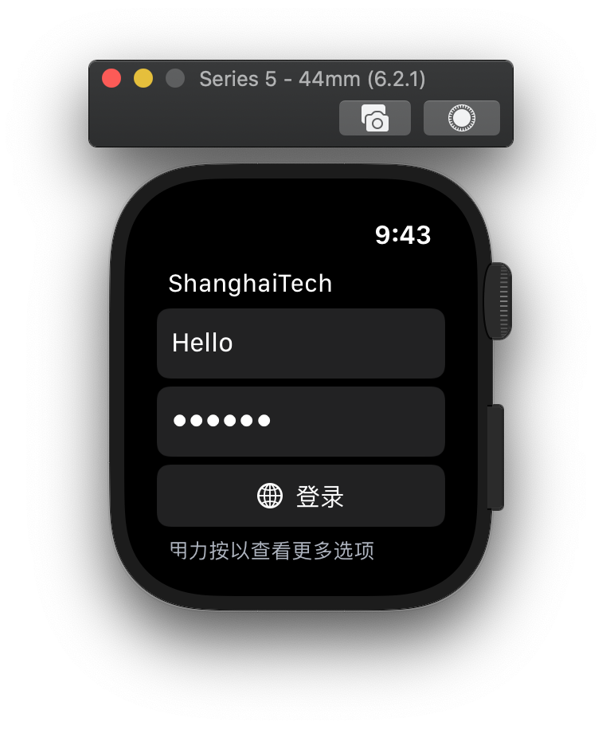

# 上科大 Wi-Fi watchOS

## 界面的样子

		
	

## 干什么的？

- 这个是用来登录 ShanghaiTech Wi-Fi 的登录器。算是我学习 Swift UI 上手的东西。仅仅做了最基础的功能，未测试。

- 需要给 Apple Watch 安装 ShanghaiTech.V2.mobileconfig，位于仓库根目录。但是我不是很确定这个描述文件一定能让 Apple Watch 连上需要网页认证的 Wi-Fi 热点。

- 目前我没搞清楚这个 App 有没有什么 Sideload 的方法，我目前甚至在测试阶段遇到了无法在设备上安装 App 的问题。有可能这个东西因为签名的关系可能大家没办法安装在自己手表上，所以仅供有兴趣的各位参考。

